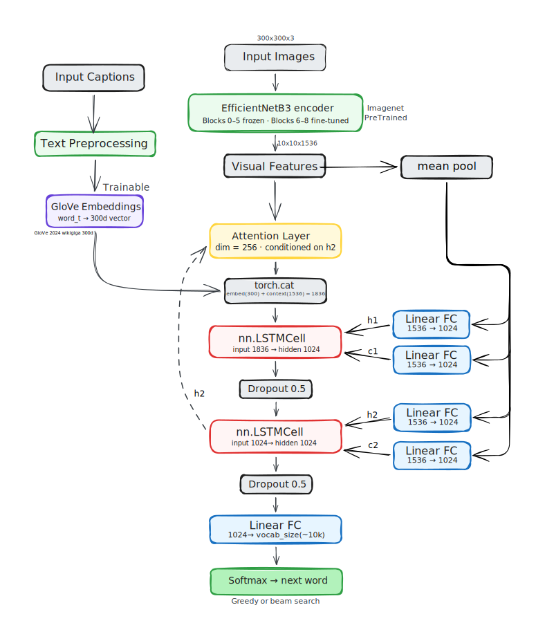

# 🖼️ Image Captioning with Deep Learning & PyTorch

> Automatic image caption generation using **EfficientNetB3** + **Stacked LSTM** + **Bahdanau Attention**, trained on Flickr8k + Flickr30k.

**BLEU-4: 0.2663 · BLEU-1: 0.6954 · Dataset: ~38K images · Epochs: 43**

---

## 📁 Project Structure

```
image-captioning/
│
├── notebook.ipynb              
├── app.py                      
├── requirements.txt
│
├── Artifacts (generated after training)
│   ├── best_model.pth             
│   ├── best_encoder.pth          
│   ├── word2idx.pkl              
│   ├── idx2word.pkl               
│   ├── captions_dict.pkl         
│   ├── image_to_path.pkl          
│   ├── train_imgs.pkl             
│   ├── val_imgs.pkl              
│   └── test_imgs.pkl              
│
└── Outputs (generated during training)
    ├── attention_training_curves.png
    └── caption_generation_sample.png
```

---

## 📦 Dataset

| Dataset | Source | Images |
|---------|--------|--------|
| Flickr8k | [Kaggle](https://www.kaggle.com/datasets/adityajn105/flickr8k) | 8,091 |
| Flickr30k | [Kaggle](https://www.kaggle.com/datasets/hsankesara/flickr-image-dataset) | 31,783 |

Split: **80% train / 10% val / 10% test** (image-level, no leakage)

---

## ⚙️ Model Architecture



---

## 📊 Test Results

| Metric | Score |
|--------|-------|
| BLEU-1 | **0.6954** |
| BLEU-2 | **0.5211** |
| BLEU-3 | **0.3791** |
| BLEU-4 | **0.2663** |
| Training Epochs | **43** (early stop) |
| Training Duration | **3.5 hours** |


---

## 🧠 Key Design Choices

| Choice | Rationale |
|--------|-----------|
| Spatial features (100×1536) | Allows attention to localize to image regions |
| Stacked 2-layer LSTM | Richer sequential representations |
| GloVe 300d initialization | Strong semantic prior before training |
| 3-tier learning rates | Protects pre-trained weights, accelerates decoder |
| Frequency threshold = 4 | Filters noise without shrinking vocab too aggressively |
| Beam search (width = 3) | Better captions than greedy at inference time |

---


## 🛠️ Tech Stack

`PyTorch` · `TorchVision` · `EfficientNetB3` · `GloVe` · `Streamlit` · `NLTK` · `KaggleHub`

---
